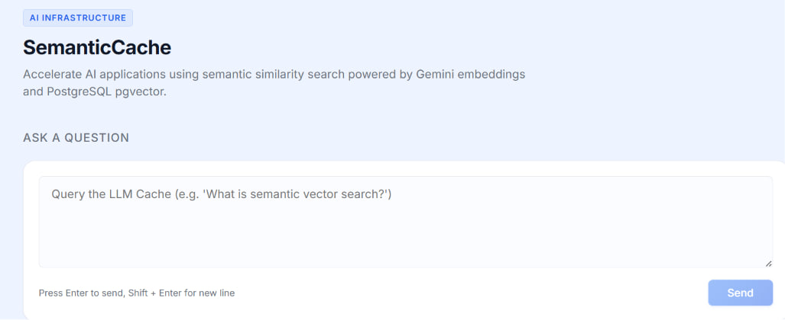
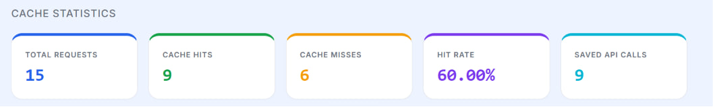

<p align="center">
  
</p>

<h1 align="center">SemanticCacheAI</h1>

<p align="center">
AI Infrastructure Tool for Intelligent Semantic Response Caching
</p>

<p align="center">
Reduce AI response latency and API costs using semantic similarity search powered by Gemini Embeddings and PostgreSQL pgvector.
</p>

<p align="center">
  
  
  
  
  
  
  
  
</p>

---

##  Live Demo

**Frontend**

https://semantic-llm-catch.vercel.app/

**Backend API**

https://semantic-cache-api.onrender.com

---

## Problem

Large Language Models (LLMs) frequently receive repeated or semantically similar prompts. Traditional caching techniques only match identical text, meaning similar requests still trigger expensive API calls.

As AI applications scale, this results in:

* Higher API costs
* Increased response latency
* Unnecessary repeated computation
* Poor resource utilization

---

## Why SemanticCache?

SemanticCache addresses this challenge by comparing the **meaning** of prompts instead of their exact wording.

Using **Gemini Embeddings** together with **PostgreSQL pgvector**, the application converts prompts into vector embeddings and performs semantic similarity search.

If a similar prompt already exists, the cached response is returned instantly instead of calling the LLM again.

This approach significantly reduces latency, lowers API usage, and improves the overall efficiency of AI-powered applications.

---

## ✨ Features

| Feature               | Description                                                |
| --------------------- | ---------------------------------------------------------- |
| Semantic Search       | Finds semantically similar prompts using vector embeddings |
| Intelligent Caching   | Returns cached responses for similar requests              |
| Gemini Flash          | Generates responses only on cache misses                   |
| Gemini Embeddings     | Converts prompts into vector representations               |
| PostgreSQL + pgvector | Stores and searches embeddings efficiently                 |
| Cache Metrics         | Tracks hits, misses and API calls saved                    |
| React Dashboard       | Modern interface for interacting with the cache            |
| REST API              | Express backend exposing chat and metrics endpoints        |

---

## 📸 Screenshots

### Home

<p align="center">
  
</p>

### Performance Overview

<p align="center">
  
</p>

---

## ⚙️ Installation

```bash
# Clone the repository
git clone https://github.com/abera-hiluf/SemanticLLMCatch.git

# Navigate to the project
cd SemanticLLMCatch

# Install backend dependencies
cd server
npm install

# Install frontend dependencies
cd ../client
npm install

# Start backend
cd ../server
npm run dev

# Start frontend
cd ../client
npm run dev
```

---

## 📄 License

This project is licensed under the MIT License.

---

## 👨‍💻 Author

**Abera Hiluf Teshale**

AI & Machine Learning Student

GitHub: https://github.com/abera-hiluf
